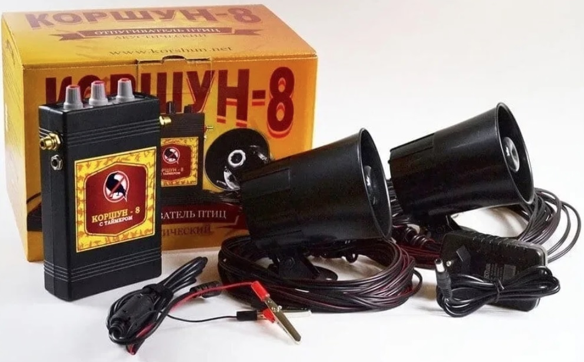

# Adjustable time relay

Реле времени с настраиваемыми временными диапазонами срабатывания.

Данный проект разрабатывался для работы со звуковыми отпугивателями птиц типо "Коршун-8". В устройстве есть таймер интервального срабатывания, но нет возможности задать определённое время включения и выключения. Поэтому было принято решение вынести эту логику в отдельное устройство, которое будет само включать и выключать отпугиватель, когда это нужно пользователю.



В программе можно настроить два диапазона работы:

```C++
TimeRange range1 = {4, 0, 0, 8, 0, 0};    // 4:00:00 - 8:00:00
TimeRange range2 = {20, 0, 0, 22, 0, 0};   // 20:00:00 - 22:00:00
```

Опционально в устройстве добавлен модуль 7-сегментного индикатора, чтобы контролировать работу устройства и корректно установленного времени. При инициализации горят все сегменты показывая 88:88.
По умолчанию время отображается каждые 2 минуты по 20 секунд.

```C++
const unsigned long TIME_DISPLAY_INTERVAL = 120000; // 2 минуты = 120 секунд
const unsigned long TIME_DISPLAY_DURATION = 20000;  // 20 секунд показа времени
const unsigned long ERROR_DISPLAY_DURATION = 5000;  // 5 секунд показа ошибки
```

## Необходимые компоненты

- Одноканальный модуль реле 5V
- Часы реального времени DS3231
- Понижающий DC DC преобразователь LM317
- Модуль 7-сегментного индикатора TM1637
- Arduino NANO


